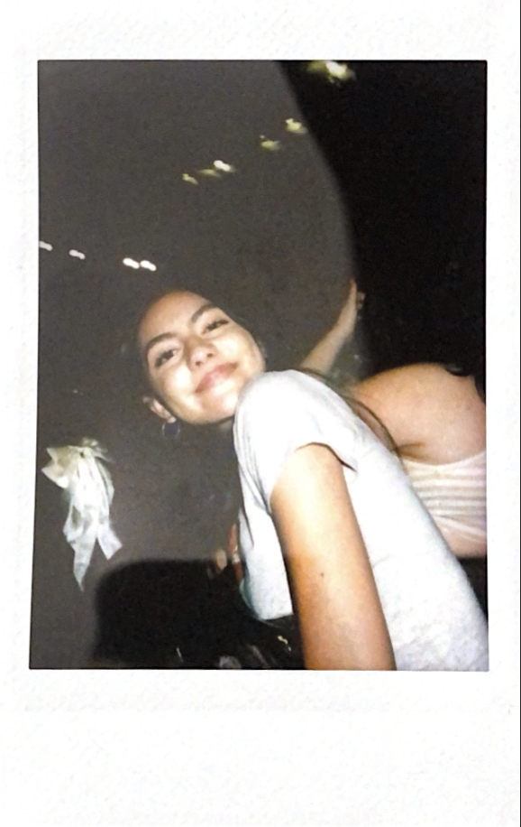

# About me

::::::: columns
::: {.column width="25%"}

:::

::: {.column width="25%"}

:::

::: {.column width="25%"}

:::

::: {.column width="25%"}

:::
:::::::

Hi!! My name is Valeria Fierros and I am an Environmental Studies student with a concentration in Ecology, Evolution, and Marine Biology at the University of California, Santa Barbara. Through my coursework and research experiences, I've developed interests in wildlife ecology, conservation planning, and environmental data analysis. I enjoy working with ecological data and learning how field and lab research can help us better understand and protect ecosystems.

I've gained hand-on experience through fieldwork and research projects, including assisting with ecological research here at UCSB. These experiences have helped me develop very useful skills in data collection, analysis, and scientific communication.

I also work part-time at an after-school child care center in an elementary school, which is such a fun part of my breaks from academics!

Outside of school, I enjoy creative and relaxing hobbies like reading, crocheting, and attending concerts!

# Education

## Education

University of California, Santa Barbara

Bachelor of Science in Environmental Studies

Concentration: Ecology, Evolution, and Marine Biology

Expected Graduation: June 2026

# Experience

## Experience

**Undergrad EEMB Research Assistant**

Goleta, CA \| University of California, Santa Barbara - Cheadle Center for Biodiversity and Ecological Restoration

September 2025 - Present

-   Imaged plant fragments using microscopy techniques for microhistological analysis

-   Collected and organized high-resolution images to assist in plant species identification from cattle fecal samples

-   Maintained and calibrated laboratory microscopes and imaging equipment

-   Cataloged and managed digital image datasets for use in ecological research

-   Organized image data in excel spreadsheets

**Santa Cruz Island Restoration Intern**

Channel Islands National Park\| California Institute of Environmental Studies

January 2022 - June 2022

-   Aided in field work of behavioral research of the Santa Cruz Island raven population

-   Configured and used various field tools and equipment as well as collected data for several hours to assist in ongoing research projects

-   Harvested and collected data from Santa Cruz Island native and invasive plant species

{fig-align="center" width="400px"}

**Environmental Field Studies Student**

Ventura, CA

August 2021 - June 2022

-   Participated in various field experiences in collaboration with the Santa Barbara Channel Keeper

-   Collected and analyzed data samples from the Ventura River and Ventura River Estuary to evaluate water quality

-   Set up field trails cameras at the Ventura River to capture images and data of local species populations
