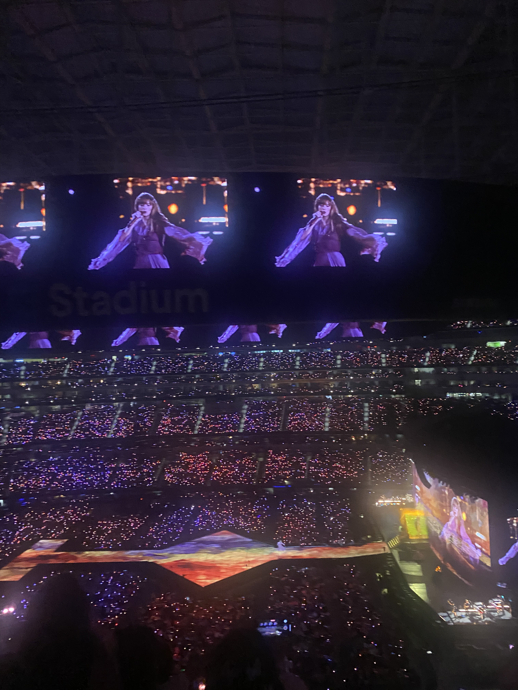
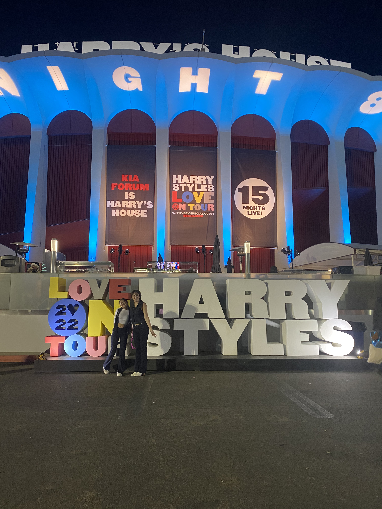
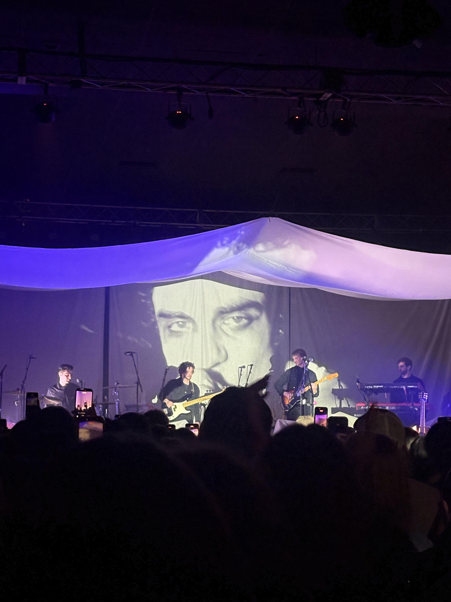
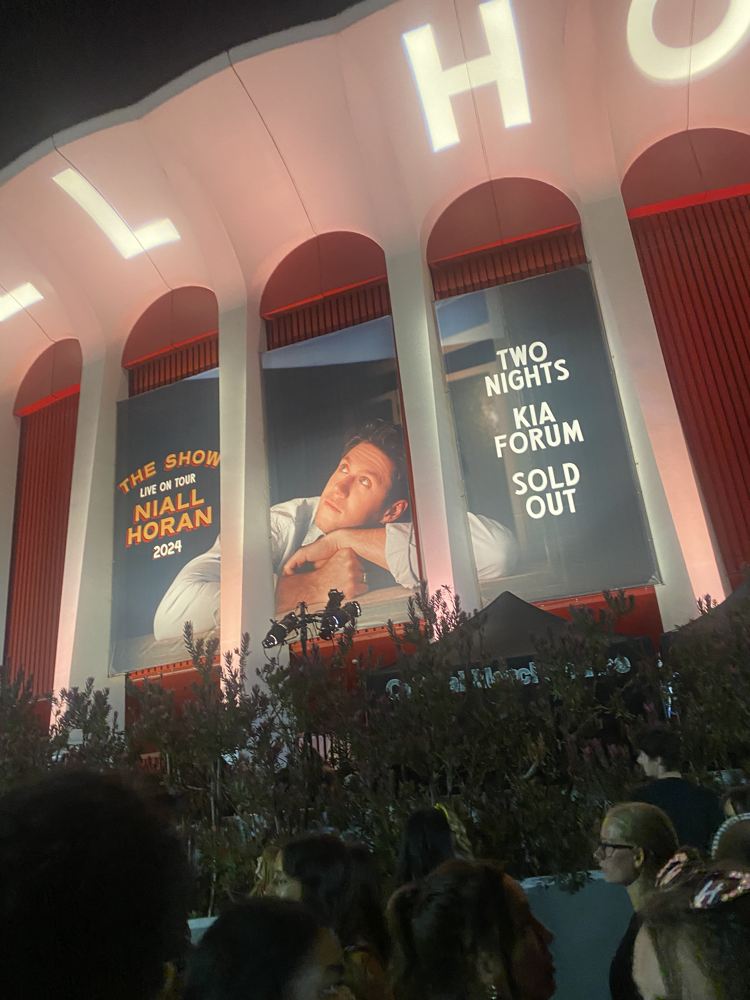

# Interests

## Reading

Reading is one of my favorite ways to relax. I enjoy reading literary fiction and contemporary novels; I've also recently been getting into reading classics!

You can see what I'm currently reading here:

[Currently Reading](https://www.goodreads.com/user/email_signature_destination/56111941?utm_medium=reading_link&utm_source=email_signature)

[{alt="Book Cover"}](https://www.goodreads.com/user/email_signature_destination/56111941?utm_medium=cover&utm_source=email_signature)

[{alt="Goodreads Logo"}](https://www.goodreads.com/?utm_medium=gr_logo&utm_source=email_signature)

## Concerts & Music

I also love listening to music and seeing my favorite artists live in concert whenever I get the chance. Some of my favorites have been Taylor Swift, Harry Styles, Del Water Gap, and Niall Horan. Here are some photos from these shows and a Spotify playlist of my favorite songs right now!

::::::: columns
::: {.column width="25%"}

:::

::: {.column width="25%"}

:::

::: {.column width="25%"}

:::

::: {.column width="25%"}

:::
:::::::

<iframe data-testid="embed-iframe" style="border-radius:12px" src="https://open.spotify.com/embed/playlist/5k3wRGD7JCephVaaqETq8S?utm_source=generator&amp;theme=0" width="100%" height="352" frameBorder="0" allowfullscreen allow="autoplay; clipboard-write; encrypted-media; fullscreen; picture-in-picture" loading="lazy">

</iframe>

## Crochet

Crocheting is also one of my favorite hobbies that I've gotten into recently. I enjoy making small projects, and recently created an affective data visualization through crochet. Check it out!
